  

  
  
  
  

## What is Neura?

Neura is a **deep learning framework designed for games**, making it easy to build **AI-native games**. It uses your game's native graphics API, **without CUDA**.

## Features

- **Game-loop Integration**: Run training and inference directly from your frame loop, without async/await.
- **Cross-platform Deployment**: Use your game's native graphics API directly — Neura runs right alongside your game.
- **Kernel Compiler**: Write custom kernels in Rust; Neura generates SPIR-V, HLSL, and MSL, so you do not maintain separate shader implementations.

## Document

**[Examples](examples/)**: Runnable examples for learning Neura and exploring specific concepts.

## Contact

Email: formetaohy@gmail.com

## License

[MIT](LICENSE)
